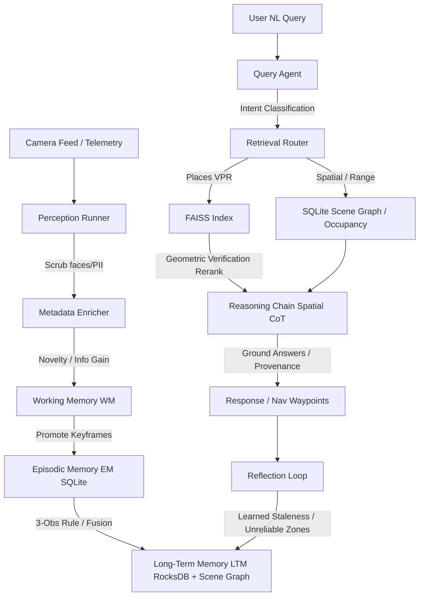

# Spatial Memory Agent (SMA)


SMA is an embodied-AI spatial intelligence system that converts a streaming monocular RGB (optionally RGB-D/IMU) feed into a **persistent, queryable, self-improving spatial memory** — not a disposable point cloud. It wraps a feed-forward streaming reconstruction frontend inside a full memory-augmented agent: three-tier memory with an explicit Memory Manager, retrieval-first spatial reasoning, and a reflection loop that improves map quality, relocalization success, and query accuracy across sessions.

---

## System Architecture



### Cognitive Memory Tiers
1. **Working Memory (WM)**: Manages current session active states (64 keyframes ring buffer, active dynamic-object tracks, covariance matrix).
2. **Episodic Memory (EM)**: Uses SQLite (WAL mode) to store full trajectories, sightings, relocalization events, and anomalies recorded during individual sessions.
3. **Long-Term Memory (LTM)**: Persists site-wide information across sessions using a hybrid metric-semantic index (RocksDB for voxel hash TSDF, SQLite for spatial scene graphs, FAISS for place embeddings).

---

## Getting Started

### Installation
Clone the repository and install the package with full testing dependencies:
```bash
git clone https://github.com/sammax1/spatialmemory.git
cd spatialmemory
pip install -e .[full]
```

### Configuration
Create a `.env` file based on `.env.example`:
```bash
cp .env.example .env
# Edit fields with your local configuration parameters
```

### Running the Flask UI Dashboard
Launch the web interface to visualize map generation, query reasoning, and path planning:
```bash
python sma_app.py
```
Open your browser and navigate to `http://localhost:5000`.

---

## Directory Layout
- `sma/perception/`: Keyframe selection, camera enrichments, and object lifting.
- `sma/memory/`: Subpackage for Working, Episodic, and Long-Term Memory layers.
- `sma/retrieval/`: Multi-index search, synonym expansion, and geometric rerankers.
- `sma/reasoning/`: Intent routing, deixis rewritings, pathplanning tools, and Chain-of-Thought engines.
- `sma/reflection/`: Map quality evaluations, staleness decay trackers, and operator feedback intake.
- `sma/safety/`: Visual input guard rails, privacy scrubbers, and RBAC controllers.
- `sma/infra/`: Session management and system configuration variables.
- `templates/`: Flask HTML template files.
- `tests/`: Automated unit and integration test directories.

---

## Contact & Contributions

For questions, collaborations, or feature proposals:
- **Developer**: Sam Max1
- **LinkedIn**: [www.linkedin.com/in/sam-max1](http://www.linkedin.com/in/sam-max1)
